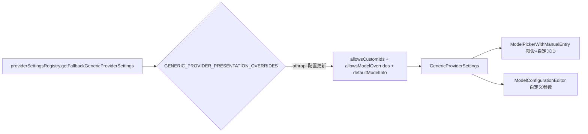

## 用户需求
让 athrapi 系列供应商（xiaomi-athrapi、xiaomi-tp-athrapi、zhipu-athrapi、dots-studio-athrapi）与 anthropic-comp 一样：既保留预设模型列表，又支持自定义模型 ID 与自定义模型参数（上下文窗口、价格、能力等）。

## 产品概述
在 Cline 设置界面的模型配置区域，athrapi 系列供应商当前只暴露预设模型或仅支持自定义 ID。改造后，用户在下拉框中既能选择预设模型，也能选择“使用自定义 ID”手动输入，并可在选中任意模型（预设或自定义）后通过“模型配置”面板覆盖其参数。

## 核心功能
- 四个 athrapi 供应商下拉框中保留预设模型列表，并新增“使用自定义 ID”入口（allowsCustomIds）。
- 选中模型后展示“模型配置”编辑器，允许用户自定义 contextWindow、maxTokens、价格、推理/图片/缓存等能力（allowsModelOverrides）。
- 为自定义 ID 场景提供合理的 defaultModelInfo 默认参数，保持与 anthropic-comp 一致的使用体验。


## 技术栈
- 前端框架：React + TypeScript（VS Code 扩展 Webview）
- 现有组件：GenericProviderSettings、ModelPickerWithManualEntry、ModelConfigurationEditor
- 配置注册表：providerSettingsRegistry.ts（getFallbackGenericProviderSettings）

## 实现方案
### 策略
仅修改 `providerSettingsRegistry.ts` 中四个 athrapi 供应商的 `GENERIC_PROVIDER_PRESENTATION_OVERRIDES` 配置项，使其与 anthropic-comp 对齐。预设模型列表来自 `getModelIds(providerId)`（由 builtins.ts 提供），`allowsCustomIds` 只是在下拉框中叠加“使用自定义 ID”选项，不会移除预设；`allowsModelOverrides` 控制 `GenericProviderSettings` 是否渲染 `ModelConfigurationEditor`，实现自定义参数。

### 关键技术决策
- **不修改 builtins.ts**：四个 athrapi 供应商已有本地预设模型（通过 `modelsProviderId` 或 `modelsFactory` 提供），无需改动后端预设数据。
- **不设置 skipModelListFetch**：anthropic-comp 设为 true 是因为无模型目录、纯手动。athrapi 有本地预设，应保留从预设拉取，仅叠加自定义能力（与 dots-studio、together 等同类供应商一致）。
- **提供 defaultModelInfo**：为四个供应商设置合理的默认参数（基于各自现有预设模型推导，如 contextWindow 350K/393K、pricing 等），优化自定义 ID 时的初始体验，对齐 anthropic-comp。
- **复用现有文案**：modelPicker.useCustomId / notInList 等 i18n 文案已由 anthropic-comp 使用，无需新增 locale 条目。

### 各供应商目标配置
- `xiaomi-athrapi`：`allowsCustomIds: true`（原 false），新增 `allowsModelOverrides: true`，`defaultModelInfo` 基于 mimo-v2.5（contextWindow 约 256K，pricing 参考）。
- `xiaomi-tp-athrapi`：`allowsCustomIds: true`（原 false），新增 `allowsModelOverrides: true`，`defaultModelInfo` 基于 mimo-v2.5-pro。
- `zhipu-athrapi`：`allowsCustomIds` 已 true，新增 `allowsModelOverrides: true`，`defaultModelInfo` 基于 glm-5.2。
- `dots-studio-athrapi`：`allowsCustomIds` 已 true，新增 `allowsModelOverrides: true`，`defaultModelInfo` 复用与 dots-studio 一致的参数（contextWindow 393_216、maxTokens 131_072、pricing 0.435/0.87 等）。

## 实现注意事项
- 保持 `GenericProviderPresentationOverride` 类型约束（allowsCustomIds / allowsModelOverrides / defaultModelInfo 均已定义）。
- 修改后需运行 `bun run test:unit` 确认 `providerSettingsRegistry.test.ts` 通过；现有测试仅覆盖 anthropic-comp / zai-coding-plan，不会被本次改动阻断，但应补充四个 athrapi 的断言以保证回归。
- 改动范围小、向后兼容：仅增强 UI 能力开关，不影响运行时协议（family: anthropic / protocol: anthropic）与预设数据。

## 架构设计
无新增模块或架构变更。仅调整配置注册表中既有供应商的展示覆盖项，复用现有 GenericProviderSettings 渲染管线：



## 目录结构
```
apps/vscode/webview-ui/src/components/settings/providers/
├── providerSettingsRegistry.ts   # [MODIFY] 更新 xiaomi-athrapi、xiaomi-tp-athrapi、zhipu-athrapi、dots-studio-athrapi 的展示覆盖配置，开启自定义 ID 与自定义参数
└── providerSettingsRegistry.test.ts  # [MODIFY] 补充四个 athrapi 供应商配置断言，确保 allowsCustomIds/allowsModelOverrides/defaultModelInfo 符合预期
```

