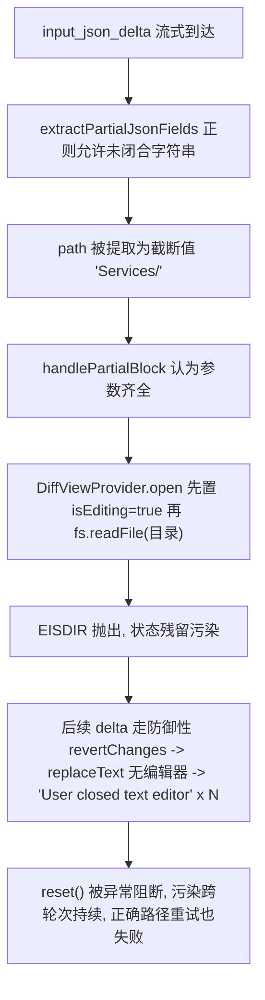

## 需求重述
用户报告：AthrAPI 供应商（zhipu-athrapi / glm-5.3:1m）开启原生工具调用后频繁报错：
- `Error executing replace_in_file: EISDIR: illegal operation on a directory, read`
- `Error executing replace_in_file: User closed text editor, unable to edit file...`

要求分析错误归属（LLM 输出错误 vs Cline 解析错误），并给出结论。基于分析结果实施修复。

## 诊断结论（已通过对会话数据与源码的双重验证）

**LLM 输出正确，属于 Cline 侧 bug**。证据：

1. `api_conversation_history.json` 消息 27/29 中，模型发送的参数为 `{"diff": "...", "path": "Services/HealthReport/DocxReportGenerator.cs"}`，与工具 schema（`zhipu-athrapi_native_athrapi.tools.snap` 中 `replace_in_file` 的 `path`/`diff` 参数）完全一致。
2. 但 UI 消息显示执行时路径却是 `[replace_in_file for 'Services/']`（截断值）。

## 三个叠加的 Cline 缺陷（错误链）
1. **部分 JSON 提取过早**：`StreamResponseHandler.extractPartialJsonFields` 的正则尾部 `(?:")?` 使闭合引号可选——流式中 `"path": "Services/`（值尚未流完）被提取为 `path="Services/"`。
2. **目录路径无守卫**：截断路径直达 `DiffViewProvider.open()`，其先置 `isEditing=true`，再 `fs.readFile(目录)` 抛 EISDIR。
3. **错误路径状态污染**：EISDIR 后 diffViewProvider 残留 `isEditing=true / editType="modify" / activeDiffEditor=undefined`；后续 `revertChanges()` 内 `replaceText` 再抛 "User closed text editor" 且阻断了 `reset()` 执行——导致同一轮 6 次连锁报错，且第二轮模型用完整正确路径重试仍失败。

## 修复目标
- 截断的 JSON 字符串值不再被提前提取（治本）
- 目录路径在打开 diff 视图前被拦截并返回明确错误（纵深防御）
- DiffViewProvider 状态事务化，任何失败路径不再污染后续工具调用（消除级联）
- 补充单元测试锁定以上行为


## 技术栈
- 现有项目：TypeScript + VS Code Extension（apps/vscode），无需引入新依赖
- 修改均为核心执行链路上的小范围手术式改动，不改变架构

## 根因链路（已验证）


## 修复方案（三层防御）

### 修复 1：治本——部分 JSON 提取强制闭合引号
文件：`apps/vscode/src/core/task/StreamResponseHandler.ts`（258-267 行 `extractPartialJsonFields`）

将正则从 `/"(\w+)":\s*"((?:[^"\\]|\\.)*)(?:")?/g` 改为 `/"(\w+)":\s*"((?:[^"\\]|\\.)*)"/g`（删除 `(?:")?` 可选项）。效果：`"path": "Services/` 未闭合时不提取该字段，`handlePartialBlock` 因 `rawRelPath` 为空提前返回，等待完整值。代价仅为流式 UI 中该工具行稍晚出现（与 XML 流式行为一致），无功能损失。

### 修复 2：纵深——目录路径守卫，禁止目录进入 diff 视图
文件：`apps/vscode/src/core/task/tools/handlers/WriteToFileToolHandler.ts`（`validateAndPrepareFileOperation`，437 行起）

在 clineignore 检查之后、任何 `diffViewProvider` 交互之前新增守卫：
- 文本预检：`resolvedPath` 以 `/` 或 `\` 结尾视为目录路径
- 磁盘检查：`await fs.stat(absolutePath).catch(() => null)`，`stat?.isDirectory()` 为真则拦截
- partial 块：静默 `return`（避免流式 UI 闪烁）
- complete 块：`consecutiveMistakeCount++`、`say("error", ...)`、`pushToolResult(formatResponse.toolError("path '...' is a directory, not a file. Provide the complete target file path."))`，并按 clineignore 拦截块的现有模式（455-475 行）处理 `didAlreadyUseTool`——模型可据此自我纠正

### 修复 3：消除级联——DiffViewProvider 状态事务化
文件：`apps/vscode/src/integrations/editor/DiffViewProvider.ts`

- `open()`（31-69 行）：将 `this.isEditing = true`（32 行）移至文件内容读取成功之后（`openDiffEditor()` 前），并用 try/catch 包裹剩余步骤，任何抛错时自行 `await this.reset()` 后 rethrow——保证 open 失败不留脏状态
- `revertChanges()`（412-453 行）：modify 分支中 `replaceText`/`saveDocument` 用 try/catch 包裹（记 warn 日志），`closeAllDiffViews()` 与结尾 `reset()` 移入 finally——彻底消除 "User closed text editor" 异常阻断 reset 的级联源

### 修复 4：兜底——错误路径统一清理
- `apps/vscode/src/core/task/ToolExecutor.ts` `handleError`（237-244 行）：当失败工具为 write_to_file/replace_in_file/new_rule 时，对 `this.diffViewProvider`（构造器已持有）执行 try{revertChanges}catch{}→reset 的安全清理
- `WriteToFileToolHandler.ts`：`handlePartialBlock` catch（90-95 行）与 `execute` catch（414-419 行）中，`revertChanges()` 包 try/catch，确保 `reset()` 必达

## 实施要点
- 修复 1 是唯一行为语义变化点（部分提取更保守），其余均为防御性加固，不影响正常路径
- 正则修改需同步检查 `getPartialToolUsesAsContent`/`getFinalizedToolUse` 的回退链：完整 JSON 仍优先走 `JSONParser.parsedInput` / `JSON.parse`，部分提取仅用于流式 UI，风险可控
- 保持既有日志风格（`Logger.warn`），新增守卫日志包含路径与触发阶段，便于后续诊断；不输出文件内容
- 不改动 LLM 侧工具 schema 与提示词；不动 `fileExistsAtPath` 语义（守卫用独立 stat 判断）

## 目录结构（修改清单）
```
e:/workspace/Cline/cline-cn/
├── apps/vscode/src/core/task/
│   ├── StreamResponseHandler.ts  # [MODIFY] extractPartialJsonFields 正则强制闭合引号，杜绝截断 path 提前执行
│   ├── ToolExecutor.ts           # [MODIFY] handleError 对文件编辑类工具失败时安全清理 diffViewProvider 状态
│   └── __tests__/
│       └── StreamResponseHandler.test.ts  # [NEW] 覆盖未闭合值不提取、闭合值正常提取（含转义）、部分流式期间 path 缺失
├── apps/vscode/src/core/task/tools/handlers/
│   ├── WriteToFileToolHandler.ts # [MODIFY] validateAndPrepareFileOperation 增加目录路径守卫；两处 catch 的 revert/reset 容错
│   └── __tests__/
│       └── WriteToFileToolHandler.directory-path.test.ts  # [NEW] 目录路径（含尾斜杠）被拦截、返回明确错误、不调用 diffViewProvider.open、consecutiveMistakeCount 递增
└── apps/vscode/src/integrations/editor/
    └── DiffViewProvider.ts       # [MODIFY] open() 事务化（失败自清理）；revertChanges() 容错（reset 必达），消除跨轮次状态污染
```

## 关键代码结构（仅列两处精确变更）
```ts
// StreamResponseHandler.ts — 修复 1：闭合引号必选
const pattern = /"(\w+)":\s*"((?:[^"\\]|\\.)*)"/g  // 原: /"(\w+)":\s*"((?:[^"\\]|\\.)*)(?:")?/g

// WriteToFileToolHandler.ts — 修复 2：目录守卫（位于 clineignore 检查后）
const isDirLikePath = /[\\/]$/.test(resolvedPath)
const stat = await fs.stat(absolutePath).catch(() => null)
if (isDirLikePath || stat?.isDirectory()) {
	if (block.partial) return  // 流式期间静默等待完整路径
	// complete 块: say error + pushToolResult(明确提示"路径是目录, 需提供完整文件路径") + consecutiveMistakeCount++
	// 参照同函数内 clineignore 拦截块(455-475行)的现有模式实现
}
```

